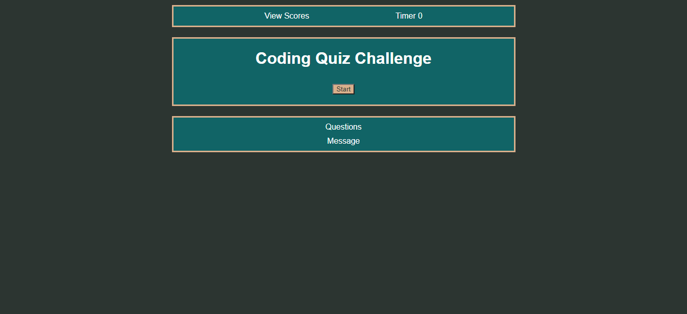

# Quiz-Challenge

A simple quiz generated by HTML, CSS and Javascript only.Answer the questions before the times runs out to test your knowledge! You will be able to store your initials or full name if your wish once you finish with all the answers or if there is no time left in the timer.
To be able to check your scores, simply click on “view scores”, you will be able to clear your results or just keep them stored. 

## Things to be improved 

Unfortunately the app is not 100% just yet... the questions are just for show at the moment, but they will be populated with real challenging questions in the future. Also I was not able to subtract time when user pick the wrong answer, but again, this feature will be added in the near future. 

Preview

 
## Link to deployed page

[https://miguel-thethird.github.io/Quiz-Challenge/] 

<!-- ### ASCII character table

 -->